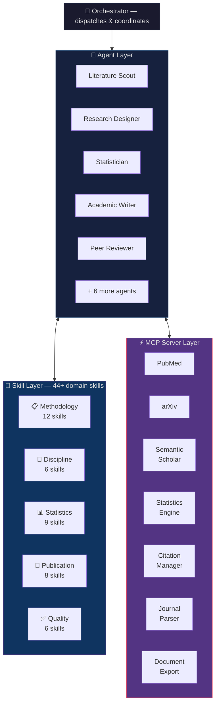

<div align="center">

# Scholar Flow

**AI-powered academic research pipeline — from literature review to submission-ready manuscript.**

Built on [Claude Code](https://claude.ai/code) agents and the [Model Context Protocol](https://modelcontextprotocol.io/).

[](https://opensource.org/licenses/MIT)
[](https://www.python.org/downloads/)
[](https://modelcontextprotocol.io/)
[](#skills)

[Getting Started](#getting-started) · [Architecture](#architecture) · [Agents](#agents) · [Skills](#skills) · [MCP Servers](#mcp-servers) · [Contributing](#contributing)

</div>

---

## What is Scholar Flow?

Scholar Flow is an open-source system of specialized AI agents that guide you through the entire academic research process. Each agent is an expert in one phase of the workflow — literature review, study design, statistical analysis, manuscript writing, and more.

**You bring the ideas and data. Scholar Flow handles the methodology.**

### Key Features

|  | Feature | Description |
|:--|:--------|:------------|
| 🤖 | **10 Specialized Agents** | Each agent masters one phase of the research pipeline |
| 🧠 | **44+ Domain Skills** | PRISMA, CONSORT, STROBE, IMRaD, and more built-in |
| ⚡ | **7 MCP Servers** | PubMed, arXiv, Semantic Scholar, statistics engine, citation manager |
| 🔬 | **Multi-discipline** | Medical, engineering, CS, social sciences, economics, law |
| 📰 | **Journal-adaptive** | Paste any journal's author guidelines, get formatted output |
| 🧑‍💻 | **Human-in-the-loop** | You make the decisions, agents do the heavy lifting |
| 📊 | **Runnable Scripts** | 14 Python CLI tools for statistics and citation management |
| ✅ | **213 Tests** | Comprehensive test suite with real-data validation |

### The Pipeline

```mermaid
flowchart LR
    subgraph row1[" "]
        direction LR
        A["🔬 Journal\nAnalyzer"] --> B["📚 Literature\nScout"] --> C["🧪 Research\nDesigner"] --> D["🧹 Data\nPreparator"] --> E["📊 Statistician"]
    end

    subgraph row2[" "]
        direction RL
        F["✍️ Academic\nWriter"] --> G["📎 Citation\nManager"] --> H["🔍 Peer\nReviewer"] --> I["📦 Document\nExport"]
    end

    E --> F

    style row1 fill:none,stroke:none
    style row2 fill:none,stroke:none
    style A fill:#4A90D9,stroke:#2C5F8A,color:#fff
    style B fill:#7B68EE,stroke:#5A4BC7,color:#fff
    style C fill:#50C878,stroke:#3A9A5C,color:#fff
    style D fill:#FFB347,stroke:#CC8E39,color:#fff
    style E fill:#FF6B6B,stroke:#CC5555,color:#fff
    style F fill:#DDA0DD,stroke:#B080B0,color:#fff
    style G fill:#87CEEB,stroke:#6BA3BC,color:#fff
    style H fill:#F0E68C,stroke:#C0B870,color:#333
    style I fill:#98FB98,stroke:#7AC87A,color:#333
```



<details>
<summary><em>Text version (if Mermaid doesn't render)</em></summary>

```
  🔬 Journal ──▶ 📚 Literature ──▶ 🧪 Research ──▶ 🧹 Data ──▶ 📊 Statistician
    Analyzer       Scout            Designer       Preparator        │
                                                                     ▼
  📦 Document ◀── 🔍 Peer ◀──── 📎 Citation ◀──── ✍️ Academic Writer
     Export        Reviewer        Manager
```

</details>

> **You bring the ideas and data. The agents handle the methodology, formatting, and compliance.**

## Getting Started

### Prerequisites

- [Claude Code](https://claude.ai/code) CLI installed
- Python 3.11+
- Git

### Installation

**Quick setup (one command):**

```bash
git clone https://github.com/sencersoylu/scholar-flow.git && cd scholar-flow && uv sync
```

<details>
<summary><strong>Detailed installation</strong></summary>

```bash
# Clone the repository
git clone https://github.com/sencersoylu/scholar-flow.git
cd scholar-flow

# Install dependencies (using uv — recommended)
uv sync

# Or with pip (install individual MCP servers)
cd mcp-servers/pubmed-mcp && pip install -e .
cd mcp-servers/arxiv-mcp && pip install -e .
# ... repeat for each server you need

# Configure API keys (optional, enhances search capabilities)
cp .env.example .env
# Edit .env with your API keys
```

</details>

### Quick Start

```bash
# Start Claude Code in the project directory
cd scholar-flow
claude

# Start a new research project
> I want to start a new research project on [your topic]

# The orchestrator will guide you through:
# 1. Setting up your researcher profile
# 2. Selecting target journal
# 3. Running the full pipeline
```

## Real Usage Examples

### Example 1: Systematic Review on Machine Learning in Radiology

```
You:    I want to conduct a systematic review on machine learning applications
        in chest X-ray diagnosis. Target journal: Radiology.

Agent:  ── Journal Analyzer ──
        Parsed Radiology author guidelines: structured abstract (≤300 words),
        STARD/PRISMA checklist required, AMA citation style.

        ── Literature Scout ──
        Searching PubMed (MeSH: "Machine Learning" AND "Radiography, Thoracic")…
        Searching arXiv (cs.CV + medical imaging)…
        Found 847 candidate papers → 312 after deduplication → 42 after
        title/abstract screening against your PICO criteria.

        ── Research Designer ──
        Proposed PRISMA 2020 flow diagram. Registered protocol fields drafted.
        Ready for your review before full-text screening begins.
```

### Example 2: Power Analysis for a Clinical Trial

```
You:    Run a power analysis for a two-arm RCT comparing a new antibiotic vs
        standard of care. Primary outcome: infection clearance at 14 days.
        Expected effect size: 15% absolute difference (70% vs 85%).

Agent:  ── Statistician (stats skill) ──
        Invoked statistics-mcp → power_analysis tool
        ┌──────────────────────────────────────┐
        │ Two-proportion z-test (two-sided)    │
        │ Alpha: 0.05 | Power: 0.80           │
        │ p1 = 0.70, p2 = 0.85               │
        │ Required n per arm: 133             │
        │ Total (with 10% dropout): 296       │
        └──────────────────────────────────────┘
        Generated script: outputs/power_analysis.py
        Recommend: also run sensitivity analysis across effect sizes 10–20%.
```

### Example 3: Format Manuscript for IEEE Access

```
You:    My manuscript draft is in outputs/draft.md. Format it for IEEE Access
        and prepare the submission package.

Agent:  ── Academic Writer ──
        Loaded ieee-style skill. Restructured to IMRaD with IEEE headings.
        Abstract condensed to 200 words. Keywords: 5 IEEE-index terms added.

        ── Citation Manager ──
        Converted 38 references to IEEE numbered style via citation-mcp.
        Verified DOIs for all entries — 2 corrections applied.

        ── Document Export ──
        Generated via document-export-mcp:
          • outputs/manuscript_ieee.docx  (IEEE Access template)
          • outputs/manuscript_ieee.tex   (LaTeX two-column)
          • outputs/figures/              (300 dpi TIF, per journal spec)
          • outputs/cover_letter.docx
        Submission checklist: 12/12 items passed.
```

## Architecture

Scholar Flow has three layers that work together:



| Layer | Purpose | Location |
|:------|:--------|:---------|
| **Agents** | Orchestrate the research workflow | `agents/` |
| **Skills** | Provide domain knowledge and methodology | `skills/` |
| **MCP Servers** | Connect to external APIs and tools | `mcp-servers/` |

See [docs/architecture.md](docs/architecture.md) for the full architecture guide.

## Agents

| | Agent | Role | MCP Tools |
|:--|:------|:-----|:----------|
| 🎯 | **Orchestrator** | Coordinates the pipeline, manages user interaction | filesystem |
| 🔬 | **Journal Analyzer** | Parses journal templates and author guidelines | journal-parser, fetch |
| 📚 | **Literature Scout** | Searches PubMed, arXiv, Semantic Scholar, Scopus, IEEE Xplore | pubmed, arxiv, semantic-scholar |
| 🧪 | **Research Designer** | Formulates research questions, hypotheses, study design | filesystem |
| 🧹 | **Data Preparator** | Cleans, validates, and prepares datasets for analysis | statistics |
| 📊 | **Statistician** | Runs statistical analyses with Python/R, generates figures | statistics |
| ✍️ | **Academic Writer** | Writes manuscripts in IMRaD structure per journal format | citation |
| 📎 | **Citation Manager** | Manages references via Zotero, validates citations | citation, zotero |
| 🔍 | **Peer Reviewer** | Reviews methodology, statistics, and reporting compliance | statistics |
| 📦 | **Document Export** | Converts to Word/LaTeX, prepares submission package | document-export |
| 🔄 | **Revision Agent** | Handles journal revision responses point-by-point | statistics |

## Skills

Skills are the knowledge layer — methodology protocols, discipline standards, and formatting rules that agents load on demand. Each skill is a folder with a `SKILL.md` definition and optional `scripts/` for runnable analysis tools.

| | Category | Count | Examples | Scripts |
|:--|:---------|:------|:---------|:--------|
| 👤 | **Profile** | 3 | researcher-profile, writing-preferences, tool-preferences | — |
| 📋 | **Methodology** | 12 | systematic-review, meta-analysis, RCT, cohort-study | — |
| 🏛️ | **Discipline** | 6 | medical, engineering, CS, social sciences, economics, law | — |
| 📊 | **Statistics** | 9 | inferential, regression, survival-analysis, bayesian, power | 11 scripts |
| 📰 | **Publication** | 8 | ama-style, ieee-style, acm-style, citation-tools | 3 scripts |
| ✅ | **Quality** | 6 | peer-review, statistical-review, reporting-checklist | — |

> **Adding your own skill?** See [docs/skill-authoring.md](docs/skill-authoring.md).

## MCP Servers

| | Server | API | Purpose |
|:--|:-------|:----|:--------|
| 🔎 | `pubmed-mcp` | NCBI E-utilities | Medical literature search, MeSH terms |
| 📄 | `arxiv-mcp` | arXiv API | Preprint search, PDF/LaTeX retrieval |
| 🕸️ | `semantic-scholar-mcp` | Semantic Scholar | Citation graphs, related papers |
| 📊 | `statistics-mcp` | Python/R runtime | Statistical analysis execution |
| 📰 | `journal-parser-mcp` | python-docx, LaTeX | Template parsing |
| 📎 | `citation-mcp` | CrossRef, BibTeX | Reference management |
| 📦 | `document-export-mcp` | Pandoc, python-docx | Final document generation |

## Supported Disciplines

| Discipline | Methodologies | Standards & Checklists |
|:-----------|:-------------|:----------------------|
| 🏥 **Medical / Health Sciences** | RCT, cohort, case-control, systematic review, meta-analysis | CONSORT, STROBE, PRISMA, CARE, MeSH, ICMJE |
| ⚙️ **Engineering / Computer Science** | Experimental, computational, benchmarks, ablation | IEEE/ACM standards, artifact evaluation |
| 🧠 **Social Sciences** | Survey, experimental, qualitative, mixed-methods | APA 7th ed., JARS, JARS-Qual, JARS-Mixed |
| 📈 **Economics** | IV, RDD, DiD, panel data, time series | AEA guidelines, NBER conventions, replication packages |
| ⚖️ **Law** | Doctrinal, comparative, empirical legal studies | Bluebook, OSCOLA, McGill Guide |

## How Scholar Flow Compares

| Feature | Scholar Flow | claude-scientific-skills | Manual Workflow |
|:--------|:------------|:------------------------|:----------------|
| Full pipeline orchestration | ✅ 10 agents | ❌ Skills only | ❌ |
| MCP server integration | ✅ 7 servers | ❌ | N/A |
| Runnable analysis scripts | ✅ 14 scripts | ✅ | Write your own |
| Multi-discipline | ✅ 6 disciplines | 🔶 Science-focused | Varies |
| Journal-adaptive formatting | ✅ | 🔶 Partial | Manual |
| Test coverage | ✅ 213 tests | ❌ | N/A |

## Contributing

We welcome contributions! Whether it's a new skill for your discipline, an MCP server for a new data source, or improvements to existing agents.

See [CONTRIBUTING.md](CONTRIBUTING.md) for guidelines.

### Ideas for Contributions
- Skills for new disciplines (social sciences, economics, law)
- MCP servers for new databases (Web of Science, DBLP, Cochrane)
- Journal style presets for popular journals
- Translations of methodology skills

## Citation

If Scholar Flow assists your research, please cite:

```bibtex
@software{scholar_flow,
  title = {Scholar Flow: AI-Powered Academic Research Pipeline},
  author = {Soylu, Sencer},
  year = {2025},
  url = {https://github.com/sencersoylu/scholar-flow},
  note = {Built on Claude Code agents and the Model Context Protocol}
}
```

## License

MIT License — see [LICENSE](LICENSE) for details.

---

<div align="center">

**Built with [Claude Code](https://claude.ai/code) and [MCP](https://modelcontextprotocol.io/)**

</div>
